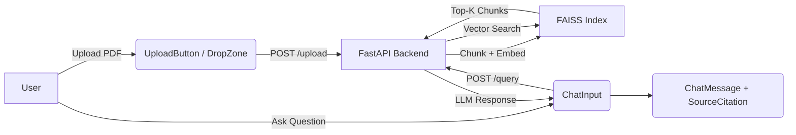

# Design Review: SmartDocs AI Frontend

**Review Date**: 2026-02-27  
**App**: SmartDocs AI — RAG-based Document Q&A Application  
**Focus Areas**: Visual Design · UX/Usability · Responsive/Mobile  
**Benchmark**: Modern AI tools (Perplexity AI, Claude, Linear)

> **Note**: This review was conducted through static backend code analysis only, as the frontend does not yet exist. All findings are *proactive recommendations* for the frontend build, not critiques of an existing implementation.

---

## Summary

SmartDocs AI is a RAG (Retrieval-Augmented Generation) application with a FastAPI backend that handles PDF upload, text chunking, FAISS vector indexing, and semantic search. The frontend is completely absent. This review provides a comprehensive design blueprint — covering information architecture, UX patterns, visual design tokens, and responsive behavior — to guide the initial frontend build toward a production-quality, modern AI tool experience.

---

## Architecture Diagram



---

## Issues & Recommendations

| # | Issue / Recommendation | Criticality | Category | Location / Action |
|---|------------------------|-------------|----------|-------------------|
| 1 | **No frontend exists** — the `frontend/` directory is completely empty with no entry point, routing, or components | 🔴 Critical | UX | Bootstrap with `npm create vite@latest frontend -- --template react-ts` |
| 2 | **No `/query` endpoint on backend** — the chat UI will have no API to call; only `/upload` is implemented | 🔴 Critical | UX | `backend/main.py` — add `POST /query` endpoint with FAISS similarity search + LLM response |
| 3 | **No CORS middleware** — FastAPI will block all browser requests from the frontend's localhost origin | 🔴 Critical | UX | `backend/main.py` — add `fastapi.middleware.cors.CORSMiddleware` |
| 4 | **Upload state feedback missing** — no loading/progress indication planned for chunking (which can take 2–10s for large PDFs) | 🟠 High | UX/Usability | Build `UploadProgressBar` component with indeterminate progress state using shadcn `Progress` |
| 5 | **No error handling UI** — failed uploads or query errors will silently fail; user has no recovery path | 🟠 High | UX/Usability | Add `ErrorBanner` / `Toast` (sonner) with retry actions for all API calls |
| 6 | **Document persistence is in-memory only** — `stored_chunks` and FAISS index reset on server restart; users lose all indexed data | 🟠 High | UX/Usability | Warn users in UI with a persistent banner: "Documents are session-only. Re-upload after server restart." |
| 7 | **No empty state design** — when no documents are uploaded, the chat area needs a compelling onboarding experience | 🟠 High | Visual Design | Design `EmptyState` hero with suggested actions: "Upload your first document to get started" |
| 8 | **No visual design tokens defined** — colors, fonts, spacing, and radii need to be established before component coding | 🟠 High | Visual Design | Create `src/index.css` with shadcn theme tokens (see Design Tokens section below) |
| 9 | **No responsive layout plan** — a fixed two-column layout will break on mobile/tablet screens | 🟠 High | Responsive | Sidebar/tray should collapse to Sheet (shadcn) on screens < 768px; bottom sheet on mobile |
| 10 | **Missing source citation UX** — users need to know *which chunk of which document* produced the answer to trust the AI | 🟡 Medium | UX/Usability | Build `SourceCitation` component showing filename + chunk index; add hover preview of chunk text |
| 11 | **No document scope selector** — users cannot target a specific document for their question | 🟡 Medium | UX/Usability | Add `ScopeFilter` chip group above chat input (All / specific docs) |
| 12 | **No typing/streaming indicator** — LLM responses should feel real-time, not appear all at once | 🟡 Medium | Micro-interactions | Implement streaming via `ReadableStream` / SSE and show `TypingIndicator` animation |
| 13 | **API key exposed in `.env`** — the OpenAI key is committed and visible; this is a security risk | 🟡 Medium | UX | Add `.env` to `.gitignore` immediately; show a Settings page where key can be entered at runtime |
| 14 | **No dark mode support** — modern AI tools universally offer dark mode | 🟡 Medium | Visual Design | Use shadcn's built-in dark mode CSS variables; add theme toggle button in header |
| 15 | **No keyboard navigation** — power users expect `Enter` to send, `Cmd+K` to focus input, `/` shortcuts | 🟡 Medium | Accessibility | Add `useHotkeys` or keyboard event handlers to `ChatInput` and global shortcuts |
| 16 | **No file validation feedback** — non-PDF uploads to `/upload` will cause a server error with no friendly message | 🟡 Medium | UX/Usability | Validate `file.type === 'application/pdf'` on the frontend before submitting |
| 17 | **Chunk size (500) hardcoded** — advanced users may want to tune this; expose it in a Settings panel | ⚪ Low | UX/Usability | `backend/main.py:25` — add optional query param; expose in Settings UI |
| 18 | **No conversation history persistence** — chat messages disappear on page refresh | ⚪ Low | UX/Usability | Use `localStorage` to persist the last N messages per session |
| 19 | **No copy-to-clipboard on AI responses** — standard UX pattern for AI tools | ⚪ Low | Micro-interactions | Add copy button to each `AIMessage` bubble using shadcn `Button` + browser Clipboard API |
| 20 | **No mobile touch targets** — interactive elements must be ≥ 44×44px for WCAG AA compliance | ⚪ Low | Responsive/Accessibility | Enforce `min-h-[44px] min-w-[44px]` on all buttons via Tailwind theme |

---

## Recommended Design Tokens

Add to `frontend/src/index.css`:

```css
@import "tailwindcss";

@theme inline {
  /* Brand */
  --color-brand:        #1a1a1a;
  --color-brand-muted:  #4a4a4a;

  /* Surface */
  --color-surface:      #ffffff;
  --color-surface-sub:  #f7f7f8;
  --color-border:       #e5e5e5;

  /* Accent */
  --color-accent:       #2563eb;
  --color-accent-light: #dbeafe;

  /* Status */
  --color-success:      #16a34a;
  --color-warning:      #d97706;
  --color-error:        #dc2626;

  /* Typography */
  --font-sans: 'Inter', system-ui, sans-serif;
  --font-mono: 'JetBrains Mono', 'Fira Code', monospace;
  
  /* Radius */
  --radius-sm:  4px;
  --radius-md:  8px;
  --radius-lg:  12px;
}
```

---

## Recommended Component Architecture

```
frontend/src/
├── components/
│   ├── layout/
│   │   ├── AppHeader.tsx          # Top bar with logo + nav
│   │   ├── DocumentSidebar.tsx    # Left panel (collapsible)
│   │   └── ChatLayout.tsx         # Main flex wrapper
│   ├── documents/
│   │   ├── DocumentCard.tsx       # Per-doc card with metadata
│   │   ├── DropZone.tsx           # Drag-drop upload area
│   │   └── UploadButton.tsx       # Trigger + progress
│   ├── chat/
│   │   ├── ChatInterface.tsx      # Message list container
│   │   ├── ChatInput.tsx          # Textarea + send button
│   │   ├── AIMessage.tsx          # AI response bubble
│   │   ├── UserMessage.tsx        # User query bubble
│   │   ├── SourceCitation.tsx     # Chunk reference pills
│   │   ├── TypingIndicator.tsx    # Animated dots
│   │   └── SuggestionChips.tsx    # Quick-start prompts
│   └── ui/                        # shadcn auto-generated
├── hooks/
│   ├── useDocuments.ts            # TanStack Query: upload + list
│   └── useChat.ts                 # TanStack Query: POST /query
├── lib/
│   └── api.ts                     # Axios/fetch base client
└── App.tsx
```

---

## Responsive Breakpoint Strategy

| Breakpoint | Layout |
|-----------|--------|
| `< 640px` (mobile) | Single column; document tray as bottom Sheet (shadcn); chat takes full screen |
| `640–1024px` (tablet) | Collapsible sidebar (icon-only collapsed state) |
| `> 1024px` (desktop) | Full dual-panel or sidebar layout |

---

## Criticality Legend

- 🔴 **Critical** — Blocks core functionality or is a security issue
- 🟠 **High** — Significantly impacts usability or first impressions
- 🟡 **Medium** — Noticeable gaps vs. modern AI tool standards
- ⚪ **Low** — Polish and nice-to-have improvements

---

## Next Steps (Prioritized)

1. **Bootstrap frontend** — Run `npm create vite@latest frontend -- --template react-ts`, install shadcn, Tailwind v4, TanStack Query
2. **Fix backend** — Add CORS middleware + `/query` endpoint before any UI work
3. **Build core layout** — Implement the chosen wireframe option (Option 1/2/3) with shadcn components
4. **Document management UI** — DropZone + DocumentCard + upload progress  
5. **Chat interface** — ChatInput → API → AIMessage + SourceCitation flow
6. **Polish** — Dark mode, empty states, error handling, keyboard shortcuts
