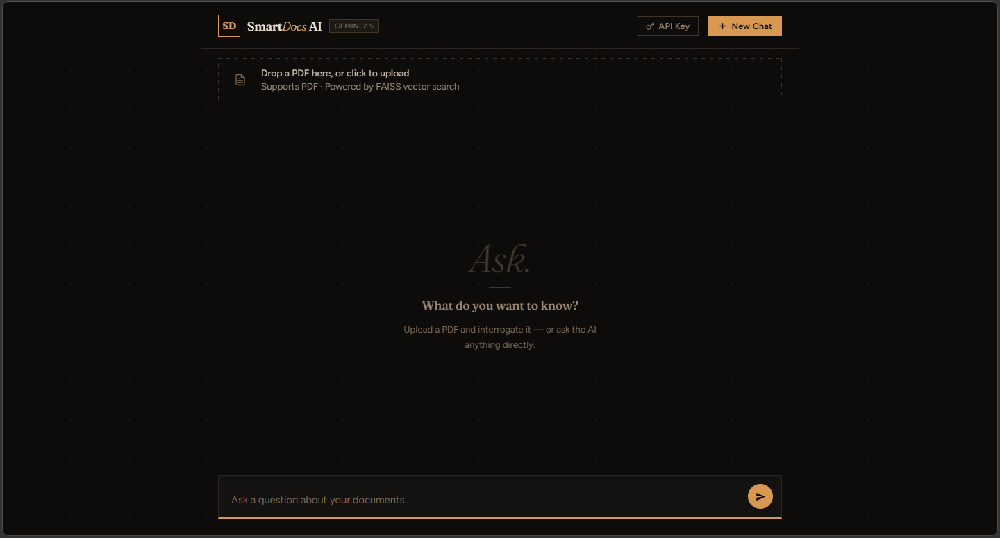

# SmartDocs AI

> An intelligent document assistant powered by **Google Gemini 2.5** and **RAG** (Retrieval-Augmented Generation). Upload your PDFs, ask questions in plain English, and get precise, context-aware answers — or just chat with the AI directly.


<!-- Replace with a real screenshot once deployed -->

---

## Features

- **PDF Upload & Processing** — Drag-and-drop or click to upload; text is extracted, chunked, and embedded automatically
- **RAG Pipeline** — Semantic search over your documents using FAISS vector index; only relevant chunks are sent to the model
- **Multi-turn Conversation** — Full chat history maintained across questions; start fresh with "New Chat"
- **Document Filtering** — Click document pills to restrict answers to specific files
- **Duplicate Detection** — MD5 hashing skips re-embedding of unchanged files on re-upload
- **Markdown Rendering** — Responses rendered with headers, code blocks, tables, and bullet lists
- **Copy Buttons** — One-click copy for full answers and individual code blocks
- **Optional API Key Auth** — Protect upload/ask endpoints with a static key
- **Persistent Store** — FAISS index and metadata saved to disk; survive server restarts

---

## Tech Stack

| Layer | Technology |
|---|---|
| Backend | Python · FastAPI · Uvicorn |
| AI / LLM | Google Gemini 2.5 Flash (`gemini-2.5-flash`) |
| Embeddings | Gemini Embedding 001 (`models/gemini-embedding-001`, 3072-dim) |
| Vector DB | FAISS (`faiss-cpu`) |
| PDF Parsing | pypdf |
| Frontend | Vanilla HTML/CSS/JS (single file) |
| Markdown | marked.js · DOMPurify |
| Deployment | Railway (or any platform with Python support) |

---

## Architecture

```
User → Frontend (index.html)
         │
         ▼
     FastAPI Backend
         │
         ├─ /upload ──► pypdf (text extraction)
         │              ──► chunk_text() [1000 chars / 200 overlap]
         │              ──► Gemini Embedding API (RETRIEVAL_DOCUMENT)
         │              ──► FAISS IndexFlatL2 (add vectors)
         │              ──► Persist to store/
         │
         └─ /ask ────► Gemini Embedding API (RETRIEVAL_QUERY)
                       ──► FAISS search (top-6, threshold L2 ≤ 2.0)
                       ──► build_prompt() [inject context chunks]
                       ──► Gemini 2.5 Flash (generate_content)
                       ──► Return answer + source chunks
```

---

## Project Structure

```
smartdocs-ai/
├── backend/
│   ├── main.py          # FastAPI app — all routes, RAG logic, Gemini calls
│   ├── .env             # Local secrets (not committed)
│   └── .env.example     # Template for environment variables
├── frontend/
│   └── index.html       # Single-file frontend (HTML + CSS + JS)
├── requirements.txt     # Python dependencies
├── Procfile             # Railway / Heroku process definition
├── railway.toml         # Railway deployment config
├── DEPLOY.md            # Deployment guide
└── README.md
```

---

## Setup

### Prerequisites

- Python 3.11+
- A [Gemini API key](https://aistudio.google.com/apikey) (free tier available)

### Local Development

```bash
# 1. Clone the repository
git clone https://github.com/YOUR_USERNAME/smartdocs-ai.git
cd smartdocs-ai

# 2. Create and activate a virtual environment
python -m venv .venv
source .venv/bin/activate        # Windows: .venv\Scripts\activate

# 3. Install dependencies
pip install -r requirements.txt

# 4. Configure environment
cp backend/.env.example backend/.env
# Edit backend/.env and add your GEMINI_API_KEY

# 5. Run the server
cd backend
uvicorn main:app --reload --port 8000
```

Open [http://localhost:8000](http://localhost:8000) in your browser.

### Environment Variables

| Variable | Required | Description |
|---|---|---|
| `GEMINI_API_KEY` | Yes | From [Google AI Studio](https://aistudio.google.com/apikey) |
| `API_KEY` | No | Protects `/upload`, `/ask`, `/reset`. Leave unset to disable auth. |
| `MAX_UPLOAD_MB` | No | Max PDF size in MB (default: `20`) |

---

## Deployment (Railway)

1. Push this repo to GitHub
2. Go to [railway.app](https://railway.app) → **New Project** → **Deploy from GitHub repo**
3. Add environment variables: `GEMINI_API_KEY` and optionally `API_KEY`
4. Railway auto-detects `railway.toml` — no extra config needed
5. Your app is live at the provided Railway domain

For persistent uploads, mount a Railway Volume at `/app/backend/uploads` and `/app/backend/store`.

---

## Screenshots

<!-- Add screenshots here after deployment -->
| Upload & Chat | Document Filtering |
|---|---|
| _coming soon_ | _coming soon_ |

---

## License

MIT
